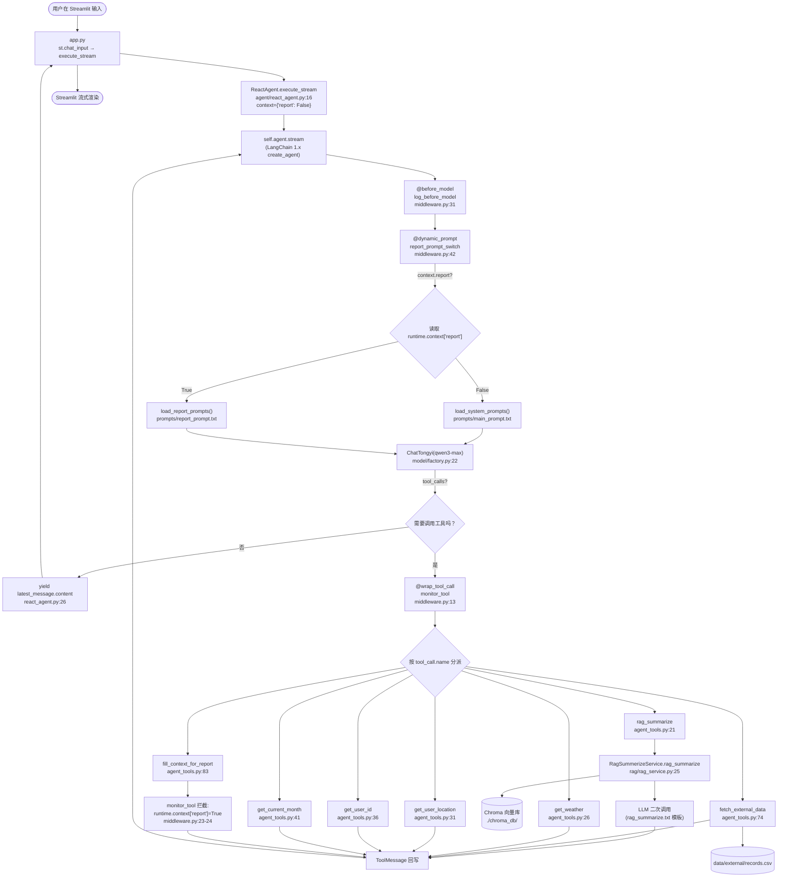
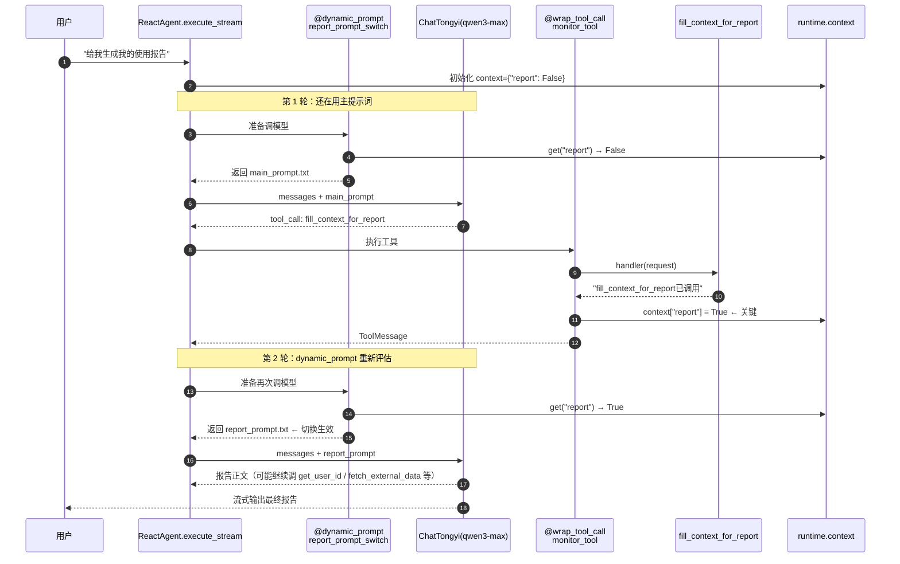
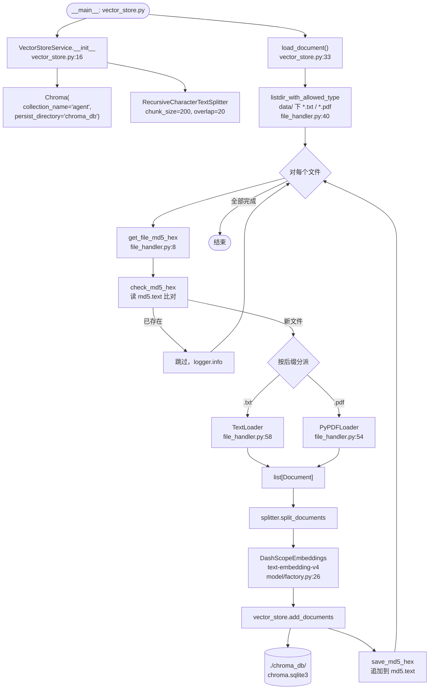

# 项目流程图

本文件用 Mermaid 描述 `p6agent智能体_rag项目` 的四张关键流程图。所有节点对应真实代码位置，便于直接跳源码定位。

> 渲染方式：GitHub / PyCharm（带 Mermaid 插件）/ VS Code Markdown Preview Mermaid Support 均可直接预览。

---

## 1. Agent 单次问答全流程

从用户在 Streamlit 输入一句话开始，到流式返回结束的端到端调用链。重点展示 LangChain 1.x 的 `create_agent` 在 LLM ↔ 工具 之间的多轮反复，以及 RAG/外部数据如何被工具拉进来。



---

## 2. 报告提示词动态切换机制

整个项目最不直观的一段逻辑。LLM 自己决定调用 `fill_context_for_report` 这个空工具，触发中间件改 runtime context，**下一轮**模型生成时 `dynamic_prompt` 才感知到，于是切到报告提示词。三处必须同步改：工具定义、`monitor_tool` 拦截分支、`report_prompt_switch` 读取键名。



> 三处同步点：
> - `agent_tools.py:83` 工具名 `fill_context_for_report`
> - `middleware.py:23` 中 `if request.tool_call["name"] == "fill_context_for_report"`
> - `middleware.py:43` 中 `request.runtime.context.get("report", False)`

---

## 3. RAG 知识库灌库流程

`python -m p6agent智能体_rag项目.rag.vector_store` 触发的离线流程。md5 去重、分片、embedding、Chroma 持久化都在 `VectorStoreService.load_document` 里。



> **清库正确做法**：同时删除 `./chroma_db/` 与 `./md5.text`。只删一个会得到「空库 + md5 已记录」 → 后续 `load_document` 把所有文件全跳过 → RAG 永远检索不到东西。

---

## 4. 系统架构（模块/数据流）

模块依赖与数据流的静态视图。重点是：`utils/path_tool` 是所有相对路径的锚点；`model/factory` 在 import 时实例化全局 `chat_model` / `embed_model`，被 RAG 与 Agent 共享；`rag_service` 在 `agent_tools` 顶层就被构造，所以 import agent 链一启动就会连 DashScope。

```mermaid
flowchart LR
    subgraph UI["UI 层"]
        App["app.py<br/>Streamlit"]
    end

    subgraph Agent["Agent 层"]
        RA["agent/react_agent.py<br/>ReactAgent + create_agent"]
        Tools["agent/tools/agent_tools.py<br/>@tool × 7"]
        MW["agent/tools/middleware.py<br/>monitor_tool / log_before_model<br/>/ report_prompt_switch"]
    end

    subgraph RAG["RAG 层"]
        RS["rag/rag_service.py<br/>RagSummerizeService"]
        VS["rag/vector_store.py<br/>VectorStoreService"]
    end

    subgraph Model["模型工厂"]
        MF["model/factory.py<br/>chat_model + embed_model<br/>(import 时实例化)"]
    end

    subgraph Utils["utils/"]
        PT["path_tool.py<br/>get_abs_path"]
        CH["config_handler.py<br/>rag_conf/chroma_conf/<br/>prompts_conf/agent_conf"]
        PL["prompts_loader.py"]
        FH["file_handler.py<br/>md5/loader/listdir"]
        LH["logger_handler.py<br/>logger 单例"]
    end

    subgraph Cfg["config/ + prompts/"]
        Y1["rag.yml<br/>chat_model_name<br/>embedding_model_name"]
        Y2["chroma.yml"]
        Y3["agent.yml"]
        Y4["prompts.yml"]
        P1["prompts/main_prompt.txt"]
        P2["prompts/report_prompt.txt"]
        P3["prompts/rag_summarize.txt"]
    end

    subgraph Data["data/ + 持久化"]
        Knw[("data/*.txt, *.pdf<br/>知识原文")]
        Ext[("data/external/records.csv<br/>外部使用记录")]
        Chr[("./chroma_db/<br/>Chroma 持久化")]
        Md5[("./md5.text<br/>去重指纹")]
        Logs[("logs/agent_YYYYMMDD.log")]
    end

    Env[/".env<br/>位于父目录 PythonAgent/<br/>ALI_API_KEY"/]

    App --> RA
    RA --> Tools
    RA --> MW
    RA --> MF
    RA --> PL

    Tools --> RS
    Tools --> Ext
    Tools --> LH
    MW --> PL
    MW --> LH

    RS --> VS
    RS --> MF
    RS --> PL
    VS --> MF
    VS --> FH
    VS --> Chr
    VS --> Md5
    VS --> Knw

    MF --> Env
    MF --> CH

    CH --> Y1
    CH --> Y2
    CH --> Y3
    CH --> Y4
    PL --> Y4
    PL --> P1
    PL --> P2
    PL --> P3

    PT -. "锚定项目根" .-> CH
    PT -. .-> PL
    PT -. .-> VS
    PT -. .-> Tools
    PT -. .-> LH

    LH --> Logs
```

> 四点容易踩坑的 import 副作用（图上用「import 时实例化」标注）：
> - `model/factory.py` import 即建模型客户端（依赖 `ALI_API_KEY`）
> - `agent/tools/agent_tools.py` 顶层 `rag = RagSummerizeService()` → import 即连 Chroma + DashScope embedding
> - `utils/config_handler.py` 顶层加载 4 个 yml
> - `utils/logger_handler.py` import 即创建 `logs/agent_*.log`
